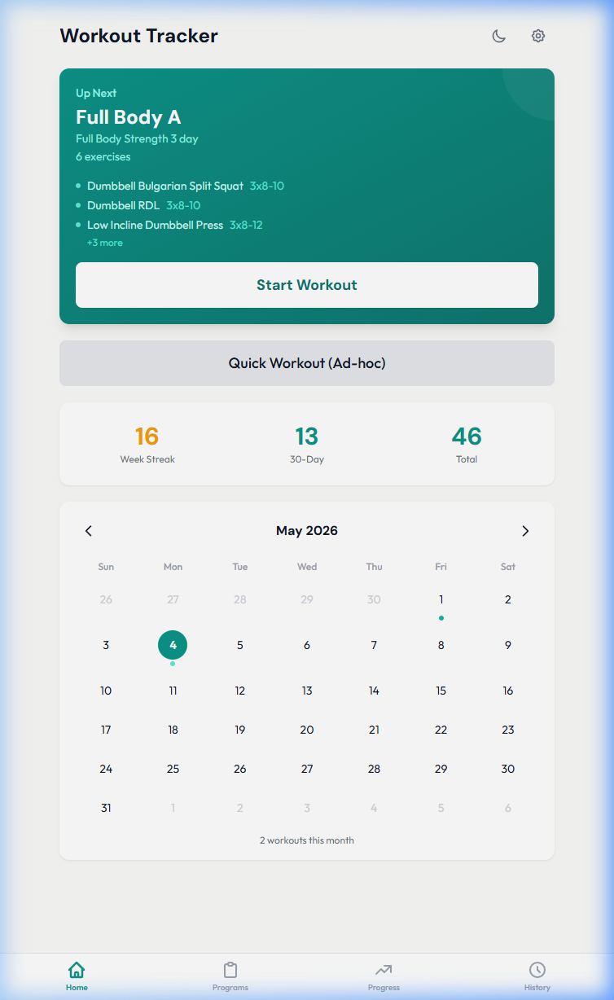
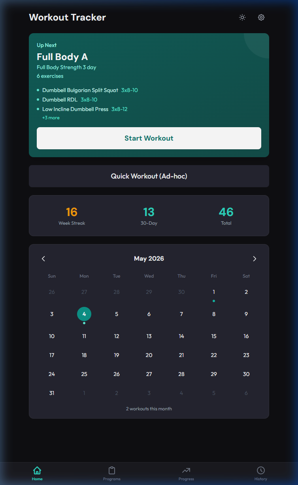
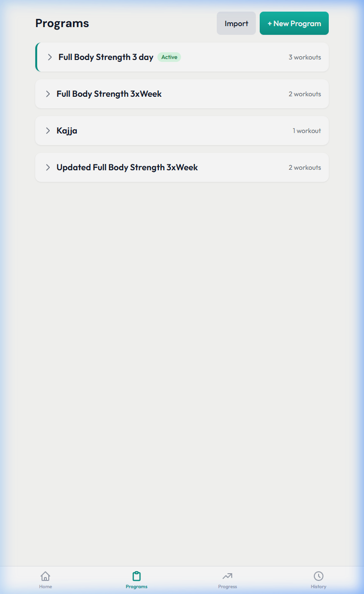
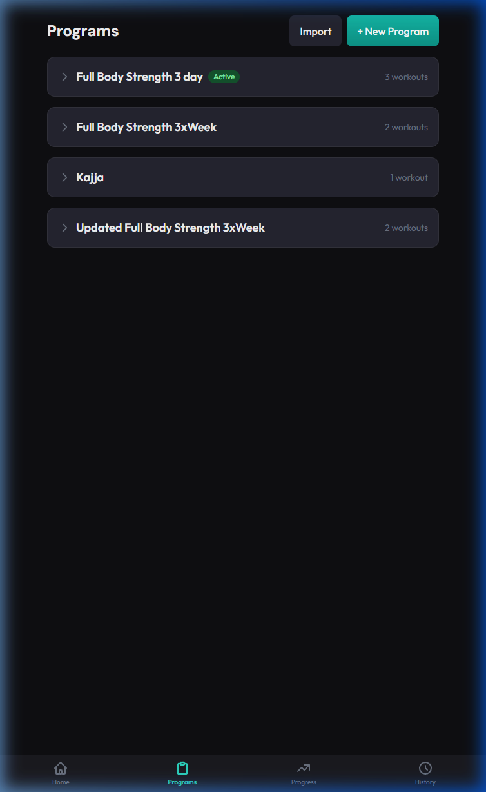
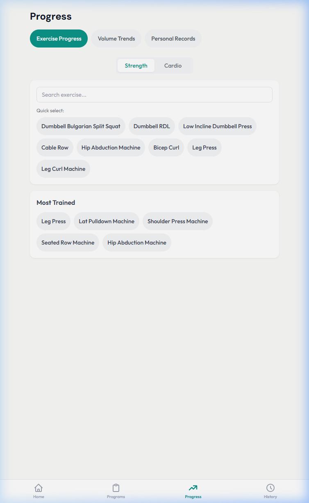
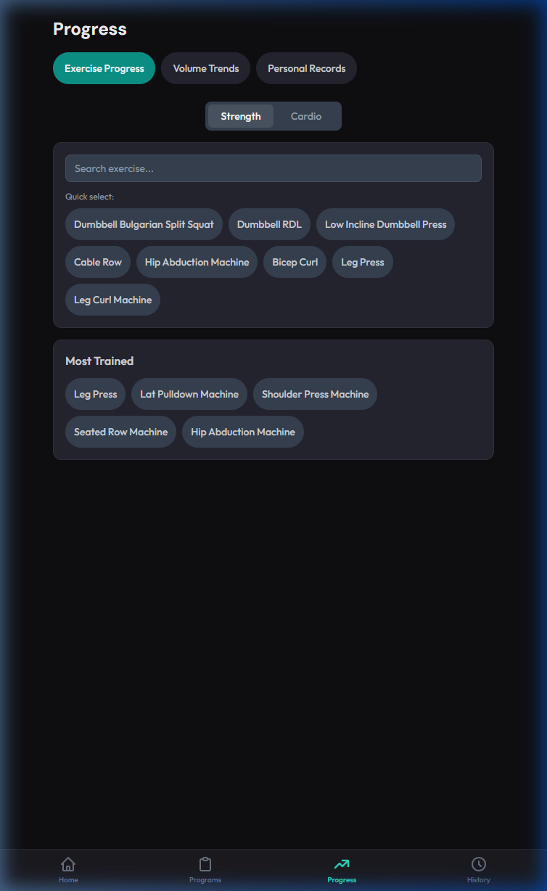
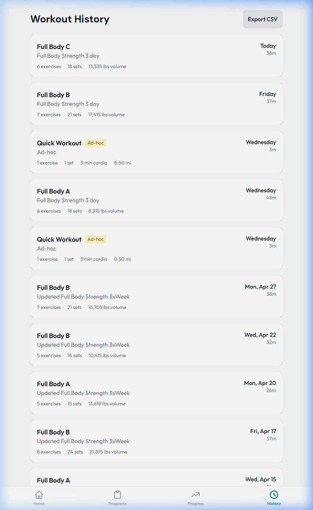
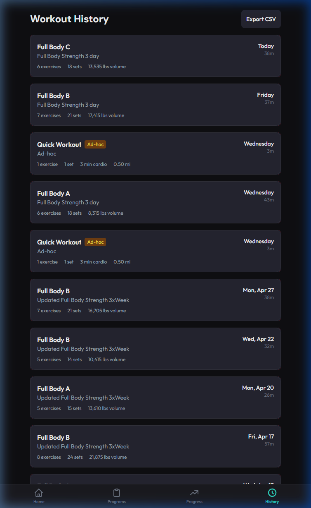

# 🏋️ Workout Tracker V2

A **self-hosted workout tracker** that's designed to be flexible — just type in whatever exercise you want, and it'll track it. No rigid exercise databases, no predefined lists. If you do it at the gym, you can log it.

| Light Mode | Dark Mode |
|:---:|:---:|
|  |  |

## ✨ Features

- **Fully flexible exercise tracking** — type any exercise name and it's tracked. No restrictions.
- **Custom programs** — build workout routines with exercises, sets, reps, and supersets
- **Active workout session** — guided workout flow with rest timers and set logging
- **RPE & notes per exercise** — prompted after each exercise for perceived effort plus optional notes ("felt strong", "left elbow tweaky"), with edit/clear UI to fix entries on the fly
- **Smart previous-set hints** — when you start a set, you see the weight, reps, *and last RPE* from your previous session so you know exactly how hard it felt last time
- **Avg RPE summaries** — completion celebration and every history card surface average RPE, so you can spot when a session was unusually hard or easy at a glance
- **Progress analytics** — exercise progress charts, volume trends, and personal records
- **Cardio analytics & HR zones** — time-in-zone summaries on completion and in your history
- **In-session PR toasts** — get notified immediately when you hit a new personal record
- **User profile** — configure your heart rate zones and application settings
- **Workout history** — browse past sessions, view details, and export to CSV
- **Workout calendar** — monthly view with workout frequency at a glance
- **Ad-hoc workouts** — jump into a quick session without a program
- **Modern UI system** — brand new typography (DM Sans + Outfit), slick gradient hero cards, and reactive Light/Dark mode themes
- **Bottom navigation** — easy one-handed gym usage with an intuitive mobile-friendly fixed tab bar
- **Offline support** — cached data available if connectivity drops

## 🤖 LLM-Friendly Workflow

The import/export features are designed to play nicely with LLMs. A typical workflow:

1. **Build a program** in the app
2. **Export it as JSON** and paste it into ChatGPT, Claude, etc. for analysis and suggestions
3. **Import the updated JSON** right back into the app — no manual re-entry
4. **Export workout history as CSV** and feed it to an LLM to spot trends, suggest deloads, or adjust programming

The structured data formats make it easy for any LLM to parse and reason about your training.

## 📸 Screenshots

<details>
<summary>Click to expand</summary>

### Programs
| Light Mode | Dark Mode |
|:---:|:---:|
|  |  |

### Progress
| Light Mode | Dark Mode |
|:---:|:---:|
|  |  |

### History
| Light Mode | Dark Mode |
|:---:|:---:|
|  |  |

</details>

## 🛠️ Tech Stack

| Layer    | Tech                                  |
|----------|---------------------------------------|
| Frontend | React 19, TypeScript, Vite, Tailwind  |
| Backend  | Express 5, Sequelize, TypeScript      |
| Database | SQLite                                |
| Deploy   | Docker, Nginx                         |

## 🚀 Installation

### Option 1: Docker (Recommended)

The easiest way to get up and running.

```bash
# Clone the repo
git clone https://github.com/RepoBean/workout-tracker.git
cd workout-tracker

# Copy the example env file
cp .env.example .env

# Build and start
docker compose up -d
```

The app will be available at **http://localhost:8035**.

### Option 2: Local Development

```bash
# Clone the repo
git clone https://github.com/RepoBean/workout-tracker.git
cd workout-tracker

# Install all dependencies (root + backend + frontend)
npm run install:all

# Start both servers in dev mode
npm run dev
```

This starts:
- **Frontend** at `http://localhost:5173`
- **Backend** at `http://localhost:3001`

Alternatively, you can use the provided shell script:

```bash
# Make the start script executable
chmod +x start.sh

# Run it
./start.sh
```

## 🌐 Accessing from the Gym

Since this is a self-hosted app running on your local network, you'll need a way to reach it when you're out at the gym. The easiest approach is to use a **VPN** (like WireGuard or Tailscale) to connect back to your home network. Once connected, just hit your server's local IP and port — for example:

```
http://192.168.1.100:8035
```

> [!TIP]
> [Tailscale](https://tailscale.com/) is a great zero-config option — install it on your server and phone, and you can access the app from anywhere without fiddling with port forwarding.

## 📁 Project Structure

```
workout-tracker-v2/
├── frontend/            # React + Vite frontend
│   └── src/
│       ├── features/    # Dashboard, Programs, Progress, History, Active Session
│       └── shared/      # Shared UI components, hooks, context
├── backend/             # Express API server
│   └── src/
│       ├── models/      # Sequelize models (SQLite)
│       └── routes/      # REST API endpoints
├── docker-compose.yml   # Docker orchestration
├── Dockerfile.backend   # Multi-stage backend build
├── Dockerfile.frontend  # Multi-stage frontend build (Nginx)
├── nginx.conf           # Nginx reverse proxy config
└── start.sh             # Dev start script
```

## 🧪 A Vibe Coding Experiment

Full transparency — this entire app was built through vibe coding with AI. The architecture, the components, the API, all of it was pair-programmed with LLMs. It's been a fun experiment in seeing how far you can push a project by describing what you want and iterating on the results. If something looks over-engineered or oddly structured, now you know why. It works, I use it every week, and that's what matters. Open to suggestions.

## 📄 License

MIT
